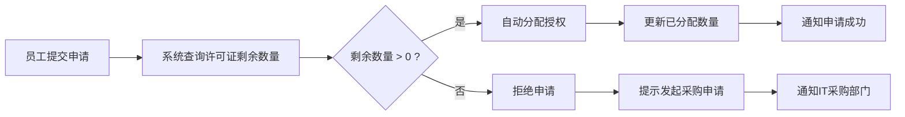

## 1. 产品概述

企业软件许可证管理系统，专为企业IT部门设计，集中管理公司采购的所有软件授权资产。解决软件授权混乱、超额使用、闲置浪费、到期遗漏等痛点，实现许可证全生命周期数字化管理。

- 核心用户：企业IT管理员、采购部门、部门负责人
- 核心价值：降低软件采购成本、规避合规风险、提升资产利用率

## 2. 核心功能

### 2.1 用户角色

| 角色 | 核心权限 |
|------|----------|
| IT管理员 | 全部功能：许可证管理、授权审批、系统配置、统计查看 |
| 普通员工 | 申请软件授权、查看已分配软件 |
| 采购专员 | 查看到期提醒、使用率报告、采购建议 |

### 2.2 功能模块

1. **仪表盘首页**：数据概览、到期预警、闲置授权提示、使用率趋势
2. **许可证管理**：许可证录入/编辑/删除、批量导入、搜索筛选、到期提醒
3. **授权分配**：员工申请、分配/回收授权、剩余数量校验、采购申请
4. **到期日历**：按月视图展示到期许可证、批量续期操作
5. **统计报表**：使用率统计、闲置授权识别、成本分析、采购建议

### 2.3 页面详情

| 页面名称 | 模块名称 | 功能描述 |
|-----------|-------------|---------------------|
| 仪表盘 | 统计卡片 | 展示总许可证数、即将到期数、闲置数、整体使用率 |
| 仪表盘 | 到期预警列表 | 展示60天内即将到期的许可证，按紧急程度排序 |
| 仪表盘 | 闲置授权提示 | 展示使用率低于50%的软件，建议缩减采购 |
| 许可证管理 | 许可证列表 | 表格展示所有许可证，支持搜索、筛选、排序 |
| 许可证管理 | 新增/编辑表单 | 录入产品名、版本、数量、到期日、授权方式、供应商等信息 |
| 许可证管理 | 批量导入 | CSV模板下载、文件上传、数据预览和校验 |
| 授权分配 | 申请列表 | 展示员工申请记录，包含申请状态、审批操作 |
| 授权分配 | 分配操作 | 选择员工和许可证，校验剩余数量，完成分配 |
| 授权分配 | 使用率统计 | 每款软件的已分配/总购买数量、百分比进度条 |
| 到期日历 | 月历视图 | 按月展示到期日期，点击日期查看详情 |
| 到期日历 | 批量操作 | 勾选多个许可证进行批量续期标记 |
| 统计报表 | 使用率排行 | 按使用率从低到高排序，识别闲置授权 |
| 统计报表 | 采购建议 | 根据使用率给出下次续期采购数量建议 |

## 3. 核心流程

### 3.1 许可证录入流程

IT管理员录入新采购的软件许可证信息，系统保存并自动生成到期提醒。

### 3.2 员工申请授权流程

员工发起软件使用申请，系统检查剩余授权数，充足则分配，不足则提示采购。

### 3.3 到期续期流程

系统在许可证到期前60天自动提醒，IT管理员确认续期后更新许可证信息。

## 4. 用户界面设计

### 4.1 设计风格

- **主色调**：深靛蓝 (#1e3a5f) 作为品牌色，搭配青色 (#0ea5e9) 作为强调色
- **辅助色**：警告橙 (#f59e0b)、危险红 (#ef4444)、成功绿 (#10b981)
- **中性色**：石板灰系列 (slate-50 到 slate-900) 用于文字和背景
- **按钮风格**：圆角 (rounded-lg)、悬停阴影、微缩放效果
- **字体**：系统字体栈，正文 14px，标题 16-24px，数据展示等宽数字
- **布局风格**：左侧导航栏 + 顶部标题栏 + 主内容卡片布局
- **图标**：Lucide React 线性图标，统一 18px 尺寸

### 4.2 页面设计概览

| 页面名称 | 模块名称 | UI元素 |
|-----------|-------------|-------------|
| 仪表盘 | 统计卡片 | 4列网格卡片，渐变色块图标，大号数字+趋势指标 |
| 仪表盘 | 到期预警 | 带紧急程度色条的列表项，悬停高亮，操作按钮 |
| 仪表盘 | 闲置提示 | 百分比进度条，警告图标，建议缩减数量 |
| 许可证管理 | 列表表格 | 斑马纹行，悬停高亮，操作列按钮，状态标签 |
| 许可证管理 | 表单弹窗 | 双列布局表单，下拉选择，日期选择器，保存/取消按钮 |
| 许可证管理 | 批量导入 | 文件拖放区域，模板下载按钮，预览表格 |
| 授权分配 | 申请列表 | 状态标签（待审批/已批准/已拒绝），审批操作按钮 |
| 授权分配 | 使用率统计 | 横向进度条，百分比数字，颜色根据使用率变化 |
| 到期日历 | 月历视图 | 7列网格日历，到期日色块标记，悬停气泡提示 |
| 统计报表 | 排行榜 | 排名序号，使用率柱状图，采购建议标签 |

### 4.3 响应式设计

- Desktop-first 设计，主内容区最小宽度 1024px
- 中等屏幕 (1024-1440px)：统计卡片保持4列，表格水平滚动
- 小屏幕 (<1024px)：导航栏折叠为抽屉菜单，统计卡片变为2列
- 触摸优化：按钮最小高度 44px，表格行点击区域扩大

### 4.4 动效与交互

- 页面加载：卡片从下往上淡入，staggered 延迟 50ms
- 悬停效果：按钮背景色过渡 150ms，卡片阴影加深
- 数据更新：数字变化时的滚动计数动画
- 弹窗过渡：背景模糊 + 缩放淡入 (200ms ease-out)
- 状态变化：进度条填充动画，标签颜色渐变
