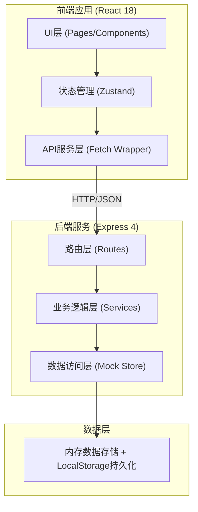
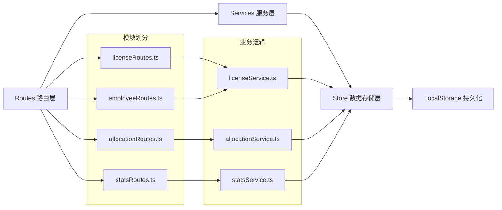
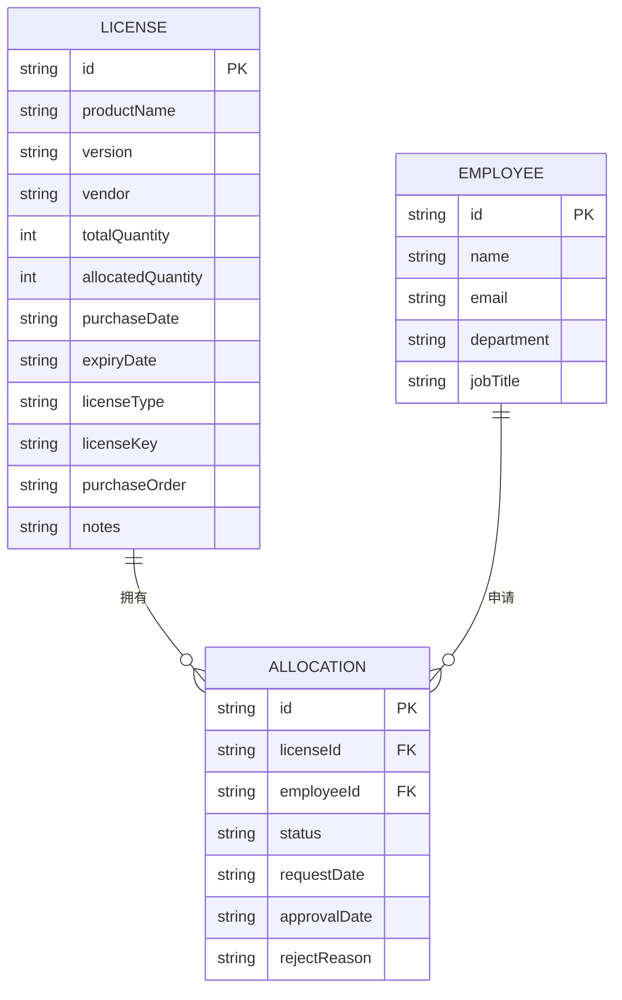

## 1. 架构设计



## 2. 技术描述

- **前端**：React@18 + TypeScript + Tailwind CSS@3 + Vite
- **路由**：react-router-dom@6
- **状态管理**：zustand@4
- **图标**：lucide-react
- **后端**：Express@4 + TypeScript
- **初始化工具**：vite-init (react-express-ts 模板)
- **数据存储**：内存数据结构 + LocalStorage 持久化（无需数据库）
- **数据模拟**：内置完整Mock数据，直接可运行演示

## 3. 路由定义

### 前端路由 (React Router)

| 路由路径 | 页面组件 | 功能说明 |
|----------|----------|----------|
| `/` | Dashboard | 仪表盘首页（数据概览、到期预警、闲置提示） |
| `/licenses` | LicenseList | 许可证管理（列表、增删改查、批量导入） |
| `/allocations` | AllocationList | 授权分配（申请审批、使用率统计） |
| `/calendar` | ExpiryCalendar | 到期日历视图 |
| `/reports` | UsageReport | 统计报表与采购建议 |

### 后端API路由 (Express)

| 方法 | 路径 | 功能说明 |
|------|------|----------|
| GET | `/api/licenses` | 获取所有许可证列表 |
| GET | `/api/licenses/:id` | 获取单个许可证详情 |
| POST | `/api/licenses` | 新增许可证 |
| PUT | `/api/licenses/:id` | 更新许可证信息 |
| DELETE | `/api/licenses/:id` | 删除许可证 |
| POST | `/api/licenses/batch-import` | 批量导入许可证 |
| GET | `/api/allocations` | 获取所有分配记录 |
| POST | `/api/allocations` | 创建分配记录（授权申请） |
| PUT | `/api/allocations/:id/status` | 更新申请状态（批准/拒绝） |
| DELETE | `/api/allocations/:id` | 回收授权（删除分配） |
| GET | `/api/employees` | 获取员工列表 |
| GET | `/api/stats/overview` | 获取仪表盘统计概览数据 |
| GET | `/api/stats/expiring?days=60` | 获取即将到期的许可证 |
| GET | `/api/stats/usage` | 获取使用率统计数据 |

## 4. API接口类型定义

```typescript
// 许可证授权方式
type LicenseType = 'per-seat' | 'per-device' | 'enterprise';

// 许可证状态
type LicenseStatus = 'active' | 'expiring-soon' | 'expired';

// 申请状态
type RequestStatus = 'pending' | 'approved' | 'rejected';

// 许可证数据模型
interface License {
  id: string;
  productName: string;
  version: string;
  vendor: string;
  totalQuantity: number;
  allocatedQuantity: number;
  purchaseDate: string;
  expiryDate: string;
  licenseType: LicenseType;
  licenseKey?: string;
  purchaseOrder?: string;
  notes?: string;
  createdAt: string;
  updatedAt: string;
}

// 员工数据模型
interface Employee {
  id: string;
  name: string;
  email: string;
  department: string;
  jobTitle: string;
}

// 分配记录数据模型
interface Allocation {
  id: string;
  licenseId: string;
  employeeId: string;
  status: RequestStatus;
  requestDate: string;
  approvalDate?: string;
  rejectReason?: string;
  allocatedBy?: string;
}

// 统计概览
interface StatsOverview {
  totalLicenses: number;
  expiringCount: number;
  idleCount: number;
  overallUsageRate: number;
}

// 使用率统计
interface UsageStats {
  licenseId: string;
  productName: string;
  totalQuantity: number;
  allocatedQuantity: number;
  usageRate: number;
  suggestedQuantity: number;
}
```

## 5. 服务端架构



## 6. 数据模型

### 6.1 ER关系图



### 6.2 初始Mock数据

系统启动时自动加载以下初始数据：

- **许可证**：15条示例记录，涵盖Adobe Creative Cloud、Microsoft Office 365、AutoCAD、JetBrains、VMware等常见企业软件
- **授权方式**：包含按座位(per-seat)、按设备(per-device)、企业授权(enterprise)三种类型
- **到期日期**：分布在过去30天至未来180天，覆盖已过期、即将到期、正常三种状态
- **员工**：20名示例员工，分布在研发、设计、市场、财务等部门
- **分配记录**：约30条历史分配记录，包含待审批、已批准、已拒绝三种状态
